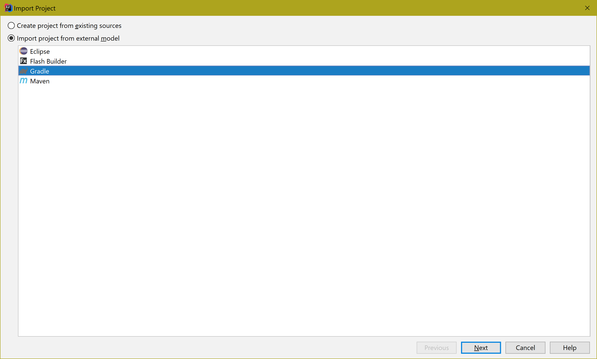
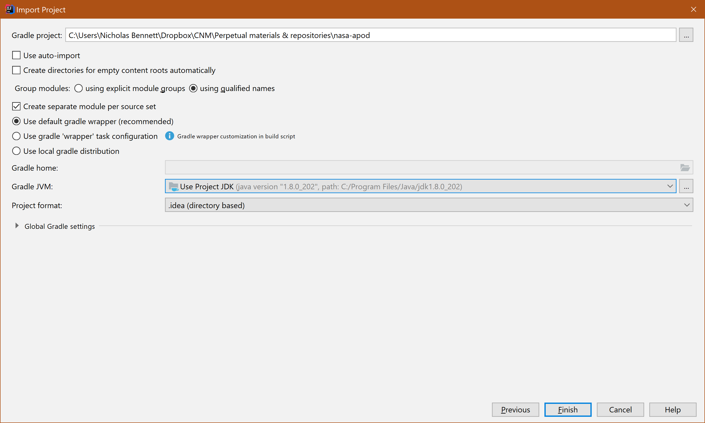
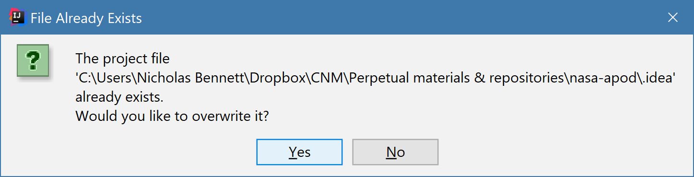
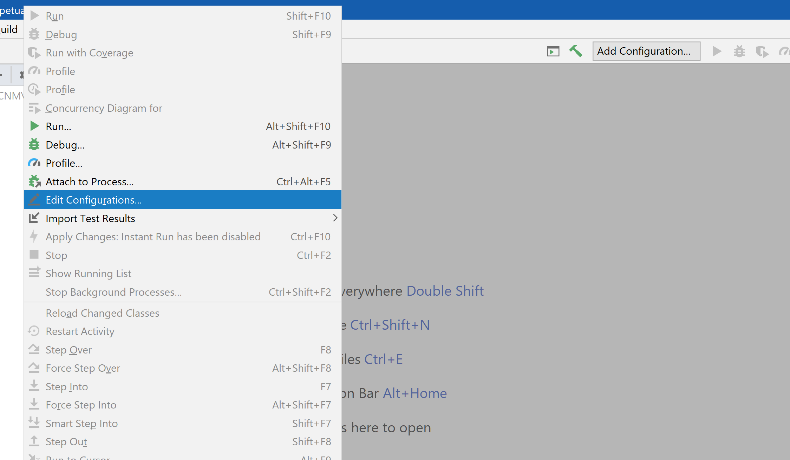
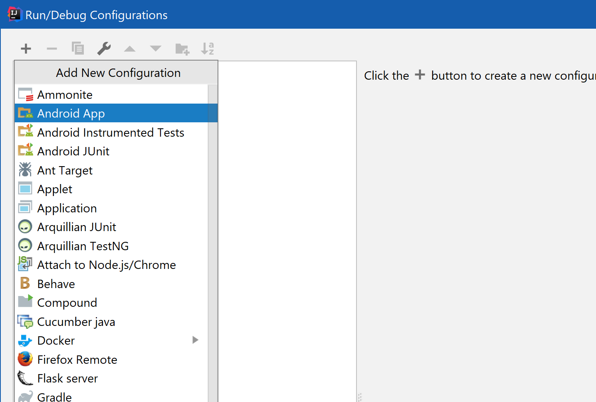
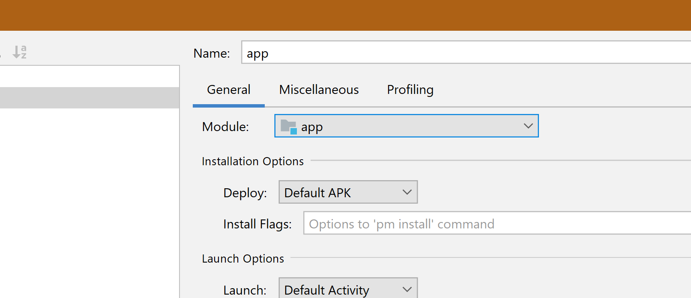
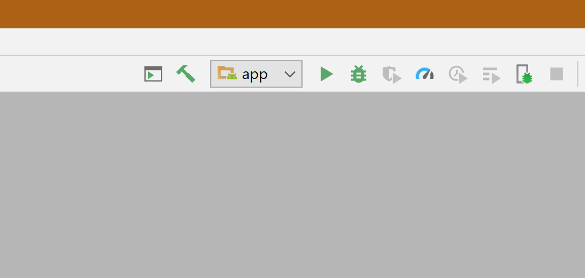

## Build instructions

1. Clone the Git repository (located at <https://github.com/deep-dive-coding-java/nasa-apod>) to your local development machine. 

    * Run the command `git clone git@github.com:deep-dive-coding-java/nasa-apod.git` (manually, or via the Git features in IntelliJ IDEA/Android Studio) to create the local clone.
        
        Alternatively, a .zip file containing the repository contents can be downloaded from <https://codeload.github.com/deep-dive-coding-java/nasa-apod/zip/master>. The entire contents of the .zip file should be extracted.

2. Obtain a NASA API key and prepare it for use by the Gradle build of the project.

    1. Fill out the form at ["Get Your API key"](https://api.nasa.gov/index.html#apply-for-an-api-key).
    
    2. When you receive your API key, create a file called `nasa.properties`, in a directory called `services`. This directory should be located in the "grandparent" directory of the project repository directory. For example, if the project has been cloned to a `bootcamp/projects/nasa-apod` directory, then the location of the `nasa,properties` file should be `bootcamp/services/nasa.properties`. (**Please note that spelling and casing are important, as is the location of the `services` directory, relative to the project directory!**)
    
    3. Edit the `nasa.properties` file so that it contains the following line of text, but with `YOUR_KEY_HERE` replaced by the the key you received (which should have ~40 characters):
    
        ```
        api_key=YOUR_KEY_HERE 
        ```
    
    4. Save the `nasa.properties` file.
    
2. Import the project into IntelliJ IDEA.

    1. From the main menu of IntelliJ IDEA, select the **File/New/Project from Existing Sources** command; or, from the **Welcome to IntelliJ IDEA** window, select the **Import Project** command.
    
    2. In the first panel of the **Import Project** wizard, select **Import project from external model**, and the **Gradle** option:
    
        
        
    3. In the next panel, most of the default options can be left unchanged. However, be sure that the **Create separate module per source set** checkbox and the **Use default Gradle wrapper (recommended)** radio button are selected, and that the Gradle JVM is set to a Java 1.8.x version:
    
        
        
        
    4. After clicking the **Finish** button, accept any file overwrite options presented, e.g. 
    
        
        
    5. Watch for any prompts asking you to import (or auto-import) Gradle changes; these are usually displayed in the lower-right of the workspace.
    
    6. The import and initial Gradle synch may take a few minutes. On completion, a successful import outcome is usually identifiable by the availability of the **Android** project view aspect option:
    
        ![Successful Import][img/successful-import.png]
        
    7. Check the **Build** window (see the **View/Tool Windows/Build** menu command) for any errors encountered in the Gradle synch process. If any errors are reported related to `nasa.properties`, please verify the correct naming and placement of the `services` directory and the `nasa.properties` file.
    
3. Even after a successful import, one important step remains&mdash;namely, adding an Android app run configuration.

    1. Select the **Run/Edit Configurations** menu command, or click the **Add Configuration** option in the toolbar at the top of the workspace:
    
        
        
    2. In the **Run/Debug Configurations** menu, click the plus sign in the upper-left, and select **Android App** from the list that appears:
    
        
        
    3. Set the **Name** field to "app" (without quotes), and select **app** from the **Module** pull-down selector:
    
        
        
    4. Click the **OK** button. After a few seconds the **app** option will appear in the toolbar at the top of the workspace, and the green run button next to it will be enabled:
    
        
        
4. Select the **Build/Rebuild Project** menu command. Any errors reported at this point are probably due to incorrect settings selected during the import, or incorrect naming, placement, or content of the `nasa.properties` file.

5. Before attempting to run, make sure you have a connected/enabled Android hardware device or emulator, running Android 5.0 (API 21) level or higher.

6. Click the run button in the toolbar, or select the **Run/Run 'app'** menu command, and select your target device.


    