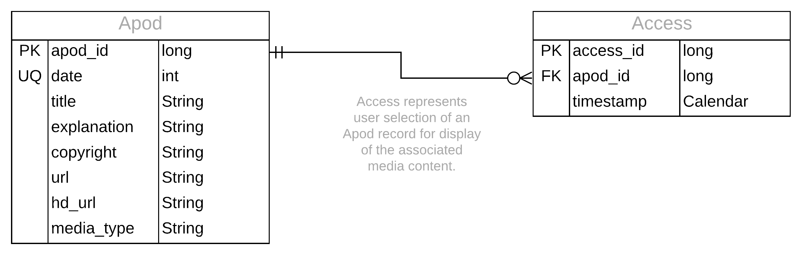

## Data Model

### Entity-Relationship Diagram



### Schema Data Definition Language (DDL)

```sql
CREATE TABLE IF NOT EXISTS `Apod` (
    `apod_id`       INTEGER PRIMARY KEY AUTOINCREMENT NOT NULL, 
    `date`          INTEGER NOT NULL, 
    `title`         TEXT, 
    `explanation`   TEXT, 
    `copyright`     TEXT, 
    `url`           TEXT, 
    `mediaType`     TEXT, 
    `hdUrl`         TEXT
);

CREATE UNIQUE INDEX `index_Apod_date` ON `Apod` (
    `date`
);

CREATE TABLE IF NOT EXISTS `Access` (
    `access_id`     INTEGER PRIMARY KEY AUTOINCREMENT NOT NULL, 
    `apod_id`       INTEGER NOT NULL, 
                    FOREIGN KEY(`apod_id`) 
                        REFERENCES `Apod`(`apod_id`) 
                        ON UPDATE NO ACTION 
                        ON DELETE CASCADE,
    `timestamp`     INTEGER 
);

CREATE INDEX `index_Access_apod_id` ON `Access` (
    `apod_id`
);
```