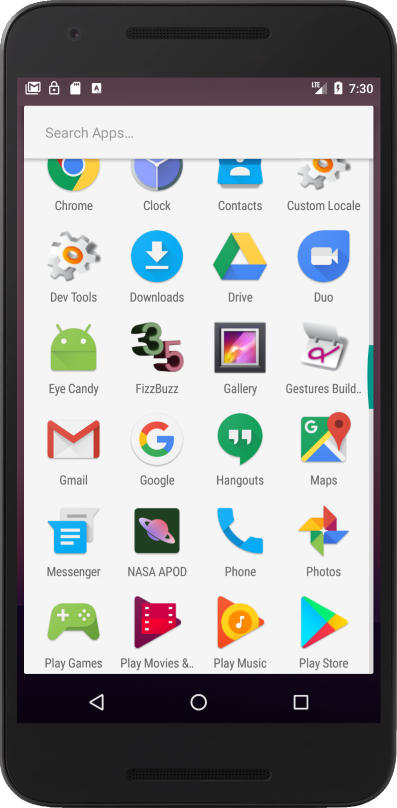
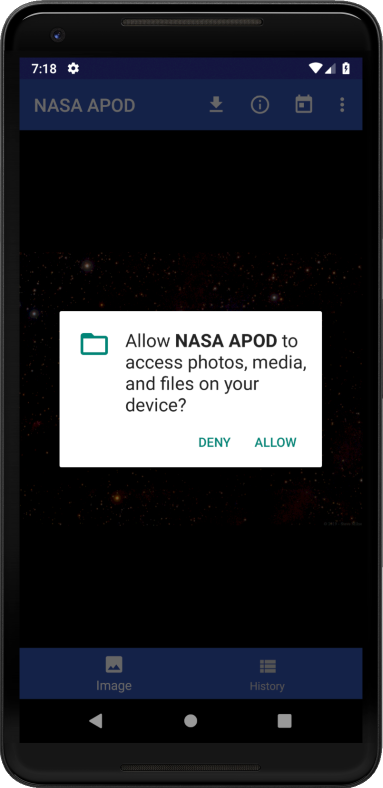
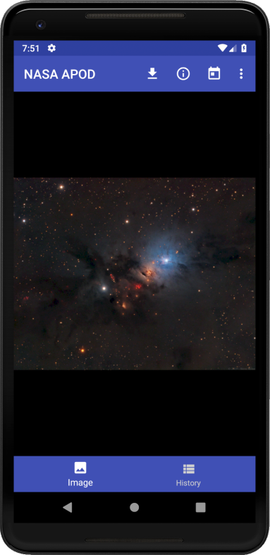

## User instructions

1. On installation, the app name appears as "NASA APOD". The launcher icon will use the rounded style on some devices, and the rectangular (or rounded rectangular) on others.

    

2. When the app is first launched on a device running Android 8.0 (API 26) or higher, permission for access to photos, media, and other files is requested. (Prior to API 26, this permission was only required to be granted on installation, not when the app was first launched.) This permission is required for the app to download images that will be available to Gallery and other Android apps.

    
    
3. After granting or denying the permission mentioned above, the APOD media for the current day is displayed.

    