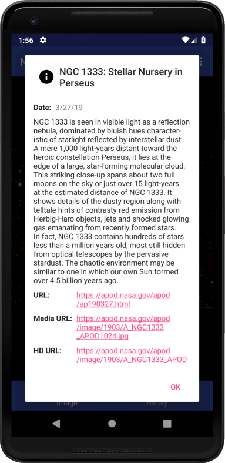
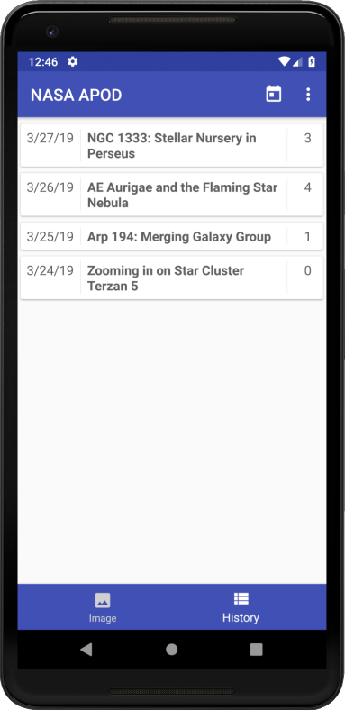
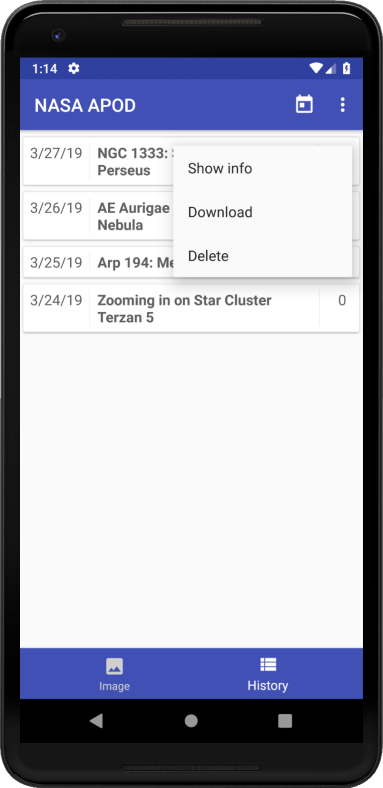

## User instructions

1. On installation, the app name appears as "NASA APOD". The launcher icon will use the rounded style on some devices, and the rectangular (or rounded rectangular) on others.

    

2. When the app is first launched on a device running Android 8.0 (API 26) or higher, permission for access to photos, media, and other files is requested. (Prior to API 26, this permission was only required to be granted on installation, not when the app was first launched.) This permission is required for the app to download images that will be available to Gallery and other Android apps.

    
    
3. After granting or denying the permission mentioned above, the APOD media for the current day is displayed.

    
    
4. The navigator view at the bottom of the screen allows the user to switch between the image view and the history view; the image view is displayed intially by default.

5. In the image view, a number of options are available in the action bar, and in the overflow menu (under the 3 vertically aligned dots):

    1. **Download** (shown as a downward arrow)
    
        When the APOD media for the selected day is an image, and if the user has granted the permission described above, the download option will appear. Clicking on it downloads the highest resolution version available of the currently displayed image; the file will be saved in the `Pictures` folder.
        
    2. **Show info** (block letter "i" in a circle)
    
        When this option is clicked, an information dialog is displayed, containing the APOD date, title, descriptive text, and links to the corresponding web page, standard-resolution media content, and (if available) high-resolution media content.
        
        
        
    3. **Pick date** (desk calendar icon)
    
        This option presents a date picker dialog, allowing you to select a date for which the APOD will be retrieved. After selecting a date and clicking **OK**, the app will make a request to the NASA APOD web service. If the request succeeds, the media content will be displayed; otherwise, an error message is displayed in a "toast" at the bottom of the screen. 
        
    4. **Delete** (in the overflow menu)
    
        Selecting this deletes the currently displayed APOD entry from the local database, and any locally cached media for that APOD (not including images downloaded to the `Pictures` folder). Then, the APOD for the current day is displayed. (One possibly unexpected consequence of this is that if the current day's APOD is deleted in this fashion, it will be re-requested and displayed immediately.)
        
    5. **Settings** (in the overflow menu)
    
        Currently, this presents an alert dialog that allows the user to modify one setting&mdash;the number of files that will be maintained in the app's internal storage. These files are managed as a _most recently used_ (MRU) cache, in which the image files for APODs that have the most recent timestamps on any related access records will be kept in internal storage, while other files will be deleted. Note that this has no effect on files downloaded to the `Pictures` folder.
        
6. The history view displays all APOD items retrieved to-date, except for those that have been deleted by the user. Each item shows the APOD date, title, and number of times the user has opened it to view the media content.

    

    The history view includes the same **Calendar** and **Settings** options (in the action bar and overflow menu) described for the image view (above). The other options are also available, but only via a context menu that appears when the user does a "long press" (click and hold) on an item in the history list:
    
    
    
    All of these options behave as described above.